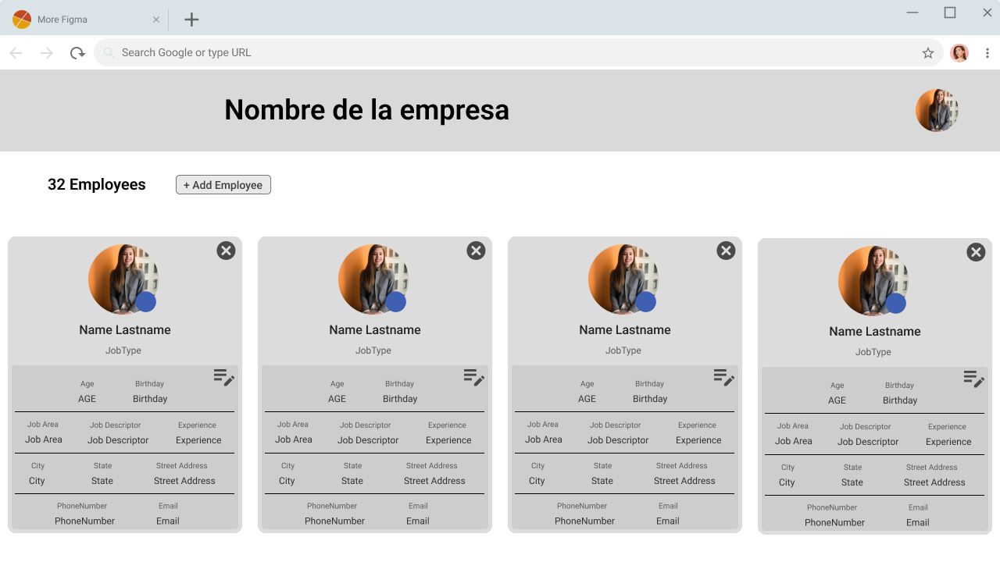

# proyecto-cuso-node

El proyecto sera una API Rest de una lista de contactos o empleados de una empresa que mostrara una carta con sus datos.
En el header tendra el nombre de la empresa y el nombre del aministrador. 

Podemos utiliza [fakerjs](https://fakerjs.dev/api/) para generar los datos aletorios de nuestra base de datos.
Los datos que contendra seran:
* Imagen de Portada por defecto color ?
* Avatar
* Nombre
* Apellido  
* Edad
* Fecha de nacimiento
* Numero de telefono
* Email
* Ciudad
* provincia (estado)
* Direccion
* Area de trabajo
* Descripcion del trabajo
* Titulo de trabajo 
* Tipo de trabajo
* Años de experiencia
* Descripcion 

La idea de es algo asi 

### Migraciones 
En este proyecto tambien se practicara Migraciones tanto para MySQL como para MongooDB con datos creados con aletoriamente con fakerjs
Para crear migraciones de bases de datos MySQL podemos utilizar [sequelize](https://sequelize.org/) que es una de las herramientas más populares.
Para crear migraciones para mongoDB podemos utilizar mongoose.

[Migraciones en sequalize](https://github.com/japsolo/curso-sequelize-migrations-seeders)

[Diseño de APIs: Entendiendo Sequelize (CLI + Migrations)](https://www.youtube.com/watch?v=6qDPwsXCc2E&ab_channel=MarluanEspiritusanto)

[Crear Seeders Mongo DB](https://ronaldl337.wordpress.com/2020/06/20/crear-seeders-en-node-js-y-mongo-db/)
[migrate-mongoose](https://www.npmjs.com/package/migrate-mongoose)